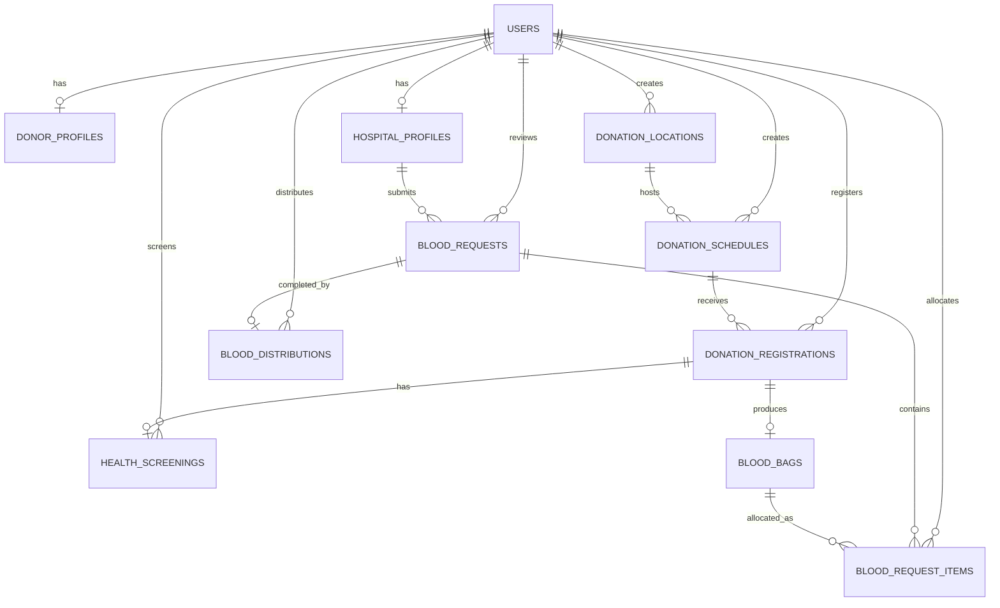

# Desain Database

## 1. Informasi Dokumen

Nama sistem:

**Sistem Informasi Manajemen Unit Donor Darah Berbasis Web**

Database:

* MariaDB
* Laravel Eloquent ORM
* Spatie Laravel Permission
* Spatie Activity Log melalui Filament Logger

Dokumen ini menjadi acuan utama saat membuat:

* Migration
* Model
* Relationship
* Factory
* Seeder
* Filament Resource
* Form Request
* Policy
* REST API

Perubahan struktur database harus memperbarui dokumen ini agar dokumentasi tetap sama dengan implementasi.

---

# 2. Prinsip Desain

Database menggunakan prinsip berikut:

1. Data autentikasi seluruh pengguna disimpan pada tabel `users`.
2. Hak akses tidak disimpan sebagai kolom role pada tabel `users`.
3. Role dan permission dikelola menggunakan Spatie Laravel Permission.
4. Profil Pendonor dan Rumah Sakit dipisahkan dari tabel `users`.
5. Satu kantong darah disimpan sebagai satu record.
6. Stok darah tidak disimpan sebagai angka manual.
7. Stok dihitung dari jumlah kantong darah yang masih tersedia.
8. Setiap permintaan darah hanya dapat melihat data milik rumah sakit terkait.
9. Alokasi kantong darah harus tercatat dan dapat diaudit.
10. Data penting menggunakan foreign key, unique constraint, dan index.
11. Status disimpan sebagai `VARCHAR` dan dikelola menggunakan PHP Enum.
12. Data transaksi tidak dihapus secara bebas.
13. Tabel transaksi penting menggunakan `softDeletes()` jika diperlukan.
14. Seluruh waktu aplikasi menggunakan zona waktu `Asia/Jakarta`.

---

# 3. Tabel Bawaan yang Dipertahankan

Tabel berikut berasal dari Laravel dan boilerplate. Tabel-tabel ini tidak boleh dihapus.

## 3.1 `users`

Menyimpan autentikasi seluruh pengguna.

Pengguna yang disimpan:

* Super Admin
* Petugas
* Pendonor
* Rumah Sakit

Struktur awal yang sudah tersedia:

| Kolom               | Tipe                   | Keterangan             |
| ------------------- | ---------------------- | ---------------------- |
| `id`                | BIGINT UNSIGNED        | Primary key            |
| `avatar_url`        | VARCHAR(255), nullable | Path avatar            |
| `name`              | VARCHAR(255)           | Nama pengguna          |
| `email`             | VARCHAR(255), unique   | Email login            |
| `email_verified_at` | TIMESTAMP, nullable    | Waktu verifikasi email |
| `password`          | VARCHAR(255)           | Password hash          |
| `remember_token`    | VARCHAR(100), nullable | Token remember me      |
| `created_at`        | TIMESTAMP              | Waktu dibuat           |
| `updated_at`        | TIMESTAMP              | Waktu diperbarui       |

Kolom tambahan yang akan ditambahkan:

| Kolom           | Tipe                          | Keterangan          |
| --------------- | ----------------------------- | ------------------- |
| `phone`         | VARCHAR(30), nullable         | Nomor telepon utama |
| `status`        | VARCHAR(30), default `active` | Status akun         |
| `last_login_at` | TIMESTAMP, nullable           | Login terakhir      |
| `last_login_ip` | VARCHAR(45), nullable         | IP login terakhir   |

Nilai `status`:

* `pending`
* `active`
* `inactive`
* `suspended`
* `rejected`

Index tambahan:

* Index pada `status`
* Index pada `phone`

Role tidak ditambahkan langsung ke tabel `users`.

Role tetap dikelola melalui tabel:

* `roles`
* `permissions`
* `model_has_roles`
* `model_has_permissions`
* `role_has_permissions`

---

## 3.2 Tabel Role dan Permission

Tabel berikut tetap dipertahankan:

* `roles`
* `permissions`
* `model_has_roles`
* `model_has_permissions`
* `role_has_permissions`

Role sistem:

* `super_admin`
* `petugas`
* `donor`
* `hospital`

Role lama bernama `user` akan diganti secara terarah melalui seeder, bukan dengan menghapus tabel role.

---

## 3.3 `activity_log`

Menyimpan riwayat aktivitas penting.

Contoh aktivitas:

* Admin membuat jadwal donor.
* Admin memverifikasi rumah sakit.
* Petugas memverifikasi pendonor.
* Petugas mencatat pemeriksaan.
* Petugas membuat kantong darah.
* Petugas mengalokasikan kantong darah.
* Petugas menyelesaikan distribusi.
* Rumah sakit membuat permintaan darah.
* Pengguna memperbarui profil.

Menu `Activity Log` pada panel admin tidak boleh dihapus.

---

# 4. Tabel Domain Sistem

Tabel baru yang akan dibuat:

1. `donor_profiles`
2. `hospital_profiles`
3. `donation_locations`
4. `donation_schedules`
5. `donation_registrations`
6. `health_screenings`
7. `blood_bags`
8. `blood_requests`
9. `blood_request_items`
10. `blood_distributions`

---

# 5. Tabel `donor_profiles`

Menyimpan profil khusus pengguna dengan role `donor`.

Relasi:

* Satu `User` memiliki maksimal satu `DonorProfile`.
* Satu `DonorProfile` hanya dimiliki satu `User`.

Struktur:

| Kolom                     | Tipe                    | Keterangan                  |
| ------------------------- | ----------------------- | --------------------------- |
| `id`                      | BIGINT UNSIGNED         | Primary key                 |
| `user_id`                 | BIGINT UNSIGNED, unique | Relasi ke `users`           |
| `donor_code`              | VARCHAR(30), unique     | Kode pendonor               |
| `birth_date`              | DATE                    | Tanggal lahir               |
| `gender`                  | VARCHAR(20)             | Jenis kelamin               |
| `blood_type`              | VARCHAR(3), nullable    | Golongan darah              |
| `rhesus`                  | VARCHAR(10), nullable   | Rhesus                      |
| `address`                 | TEXT                    | Alamat lengkap              |
| `province`                | VARCHAR(100)            | Provinsi                    |
| `city`                    | VARCHAR(100)            | Kota atau kabupaten         |
| `district`                | VARCHAR(100), nullable  | Kecamatan                   |
| `postal_code`             | VARCHAR(10), nullable   | Kode pos                    |
| `emergency_contact_name`  | VARCHAR(255), nullable  | Nama kontak darurat         |
| `emergency_contact_phone` | VARCHAR(30), nullable   | Nomor kontak darurat        |
| `last_donation_at`        | DATETIME, nullable      | Donor terakhir              |
| `is_available`            | BOOLEAN, default true   | Bersedia menerima pengingat |
| `created_at`              | TIMESTAMP               | Waktu dibuat                |
| `updated_at`              | TIMESTAMP               | Waktu diperbarui            |

Nilai `gender`:

* `male`
* `female`

Nilai `blood_type`:

* `A`
* `B`
* `AB`
* `O`

Nilai `rhesus`:

* `positive`
* `negative`

Constraint:

* `user_id` unique
* `donor_code` unique
* Foreign key `user_id` menuju `users.id`
* Saat user dihapus, profil ikut dihapus menggunakan `cascadeOnDelete()`

Index:

* Index gabungan `blood_type` dan `rhesus`
* Index pada `city`
* Index pada `is_available`

Catatan:

Golongan darah boleh kosong ketika pengguna pertama kali mendaftar. Data dapat diperbarui setelah pemeriksaan petugas.

---

# 6. Tabel `hospital_profiles`

Menyimpan profil institusi dengan role `hospital`.

Relasi:

* Satu `User` memiliki maksimal satu `HospitalProfile`.
* Satu `HospitalProfile` dapat memiliki banyak `BloodRequest`.
* Satu rumah sakit diverifikasi oleh Admin.

Struktur:

| Kolom                         | Tipe                           | Keterangan               |
| ----------------------------- | ------------------------------ | ------------------------ |
| `id`                          | BIGINT UNSIGNED                | Primary key              |
| `user_id`                     | BIGINT UNSIGNED, unique        | Relasi ke `users`        |
| `hospital_code`               | VARCHAR(30), unique            | Kode rumah sakit         |
| `hospital_name`               | VARCHAR(255)                   | Nama institusi           |
| `license_number`              | VARCHAR(100), unique           | Nomor izin operasional   |
| `license_document_path`       | VARCHAR(255), nullable         | Dokumen izin             |
| `responsible_person_name`     | VARCHAR(255)                   | Penanggung jawab         |
| `responsible_person_position` | VARCHAR(150), nullable         | Jabatan penanggung jawab |
| `address`                     | TEXT                           | Alamat                   |
| `province`                    | VARCHAR(100)                   | Provinsi                 |
| `city`                        | VARCHAR(100)                   | Kota atau kabupaten      |
| `district`                    | VARCHAR(100), nullable         | Kecamatan                |
| `postal_code`                 | VARCHAR(10), nullable          | Kode pos                 |
| `latitude`                    | DECIMAL(10,7), nullable        | Koordinat latitude       |
| `longitude`                   | DECIMAL(10,7), nullable        | Koordinat longitude      |
| `verification_status`         | VARCHAR(30), default `pending` | Status verifikasi        |
| `verified_by`                 | BIGINT UNSIGNED, nullable      | Admin yang memverifikasi |
| `verified_at`                 | TIMESTAMP, nullable            | Waktu verifikasi         |
| `rejection_reason`            | TEXT, nullable                 | Alasan penolakan         |
| `created_at`                  | TIMESTAMP                      | Waktu dibuat             |
| `updated_at`                  | TIMESTAMP                      | Waktu diperbarui         |

Nilai `verification_status`:

* `pending`
* `approved`
* `rejected`
* `suspended`

Constraint:

* `user_id` unique
* `hospital_code` unique
* `license_number` unique
* Foreign key `user_id` menuju `users.id`
* Foreign key `verified_by` menuju `users.id`
* `verified_by` menggunakan `nullOnDelete()`

Index:

* Index pada `verification_status`
* Index pada `city`
* Index gabungan `latitude` dan `longitude`

Aturan:

* Rumah sakit dengan status `pending` belum dapat mengajukan permintaan darah.
* Rumah sakit dengan status `rejected` tidak dapat login ke dashboard rumah sakit.
* Rumah sakit dengan status `suspended` tidak dapat membuat permintaan baru.
* Hanya Admin yang dapat mengubah status verifikasi.

---

# 7. Tabel `donation_locations`

Menyimpan lokasi kegiatan donor.

Relasi:

* Satu lokasi memiliki banyak jadwal donor.
* Lokasi dibuat oleh Admin atau Petugas.

Struktur:

| Kolom           | Tipe                   | Keterangan          |
| --------------- | ---------------------- | ------------------- |
| `id`            | BIGINT UNSIGNED        | Primary key         |
| `name`          | VARCHAR(255)           | Nama lokasi         |
| `slug`          | VARCHAR(255), unique   | Slug URL            |
| `address`       | TEXT                   | Alamat lengkap      |
| `province`      | VARCHAR(100)           | Provinsi            |
| `city`          | VARCHAR(100)           | Kota atau kabupaten |
| `district`      | VARCHAR(100), nullable | Kecamatan           |
| `postal_code`   | VARCHAR(10), nullable  | Kode pos            |
| `latitude`      | DECIMAL(10,7)          | Koordinat latitude  |
| `longitude`     | DECIMAL(10,7)          | Koordinat longitude |
| `contact_name`  | VARCHAR(255), nullable | Kontak lokasi       |
| `contact_phone` | VARCHAR(30), nullable  | Nomor kontak        |
| `description`   | TEXT, nullable         | Deskripsi lokasi    |
| `is_active`     | BOOLEAN, default true  | Status lokasi       |
| `created_by`    | BIGINT UNSIGNED        | Pembuat data        |
| `created_at`    | TIMESTAMP              | Waktu dibuat        |
| `updated_at`    | TIMESTAMP              | Waktu diperbarui    |
| `deleted_at`    | TIMESTAMP, nullable    | Soft delete         |

Constraint:

* `slug` unique
* Foreign key `created_by` menuju `users.id`
* `created_by` menggunakan `restrictOnDelete()`

Index:

* Index pada `is_active`
* Index pada `city`
* Index gabungan `latitude` dan `longitude`

---

# 8. Tabel `donation_schedules`

Menyimpan kegiatan atau jadwal donor darah.

Relasi:

* Satu lokasi memiliki banyak jadwal.
* Satu jadwal memiliki banyak pendaftaran donor.
* Jadwal dibuat oleh Admin atau Petugas.

Struktur:

| Kolom                   | Tipe                         | Keterangan          |
| ----------------------- | ---------------------------- | ------------------- |
| `id`                    | BIGINT UNSIGNED              | Primary key         |
| `donation_location_id`  | BIGINT UNSIGNED              | Lokasi kegiatan     |
| `schedule_code`         | VARCHAR(30), unique          | Kode jadwal         |
| `title`                 | VARCHAR(255)                 | Nama kegiatan       |
| `slug`                  | VARCHAR(255), unique         | Slug URL            |
| `description`           | TEXT, nullable               | Deskripsi           |
| `start_at`              | DATETIME                     | Waktu mulai         |
| `end_at`                | DATETIME                     | Waktu selesai       |
| `registration_open_at`  | DATETIME                     | Pendaftaran dibuka  |
| `registration_close_at` | DATETIME                     | Pendaftaran ditutup |
| `quota`                 | UNSIGNED INTEGER             | Kuota pendonor      |
| `status`                | VARCHAR(30), default `draft` | Status jadwal       |
| `banner_path`           | VARCHAR(255), nullable       | Gambar kegiatan     |
| `created_by`            | BIGINT UNSIGNED              | Pembuat jadwal      |
| `published_at`          | TIMESTAMP, nullable          | Waktu publikasi     |
| `cancelled_at`          | TIMESTAMP, nullable          | Waktu pembatalan    |
| `cancellation_reason`   | TEXT, nullable               | Alasan pembatalan   |
| `created_at`            | TIMESTAMP                    | Waktu dibuat        |
| `updated_at`            | TIMESTAMP                    | Waktu diperbarui    |
| `deleted_at`            | TIMESTAMP, nullable          | Soft delete         |

Nilai `status`:

* `draft`
* `published`
* `ongoing`
* `completed`
* `cancelled`

Constraint:

* `schedule_code` unique
* `slug` unique
* Foreign key `donation_location_id` menuju `donation_locations.id`
* Foreign key `created_by` menuju `users.id`
* Lokasi menggunakan `restrictOnDelete()`
* Pembuat menggunakan `restrictOnDelete()`

Index:

* Index pada `status`
* Index pada `start_at`
* Index pada `registration_open_at`
* Index pada `registration_close_at`
* Index gabungan `donation_location_id` dan `status`

Validasi aplikasi:

* `end_at` harus setelah `start_at`.
* `registration_close_at` harus setelah `registration_open_at`.
* Pendaftaran harus ditutup sebelum atau saat kegiatan dimulai.
* `quota` minimal satu.
* Jadwal yang sudah mempunyai transaksi tidak dihapus permanen.

---

# 9. Tabel `donation_registrations`

Menyimpan pendaftaran Pendonor pada sebuah jadwal.

Relasi:

* Satu Pendonor dapat memiliki banyak pendaftaran.
* Satu Jadwal memiliki banyak pendaftaran.
* Satu pendaftaran memiliki maksimal satu pemeriksaan.
* Satu pendaftaran menghasilkan maksimal satu kantong darah pada scope awal.

Struktur:

| Kolom                  | Tipe                           | Keterangan            |
| ---------------------- | ------------------------------ | --------------------- |
| `id`                   | BIGINT UNSIGNED                | Primary key           |
| `registration_number`  | VARCHAR(30), unique            | Nomor pendaftaran     |
| `donation_schedule_id` | BIGINT UNSIGNED                | Jadwal donor          |
| `donor_id`             | BIGINT UNSIGNED                | User Pendonor         |
| `questionnaire`        | JSON, nullable                 | Jawaban skrining awal |
| `status`               | VARCHAR(30), default `pending` | Status pendaftaran    |
| `reviewed_by`          | BIGINT UNSIGNED, nullable      | Admin atau Petugas    |
| `reviewed_at`          | TIMESTAMP, nullable            | Waktu verifikasi      |
| `rejection_reason`     | TEXT, nullable                 | Alasan ditolak        |
| `checked_in_at`        | TIMESTAMP, nullable            | Waktu kehadiran       |
| `cancelled_at`         | TIMESTAMP, nullable            | Waktu pembatalan      |
| `cancellation_reason`  | TEXT, nullable                 | Alasan pembatalan     |
| `completed_at`         | TIMESTAMP, nullable            | Waktu donor selesai   |
| `notes`                | TEXT, nullable                 | Catatan               |
| `created_at`           | TIMESTAMP                      | Waktu dibuat          |
| `updated_at`           | TIMESTAMP                      | Waktu diperbarui      |
| `deleted_at`           | TIMESTAMP, nullable            | Soft delete           |

Nilai `status`:

* `pending`
* `approved`
* `rejected`
* `attended`
* `eligible`
* `ineligible`
* `completed`
* `cancelled`
* `no_show`

Constraint:

* `registration_number` unique
* Kombinasi `donation_schedule_id` dan `donor_id` unique
* Foreign key `donation_schedule_id` menuju `donation_schedules.id`
* Foreign key `donor_id` menuju `users.id`
* Foreign key `reviewed_by` menuju `users.id`
* Jadwal menggunakan `restrictOnDelete()`
* Pendonor menggunakan `restrictOnDelete()`
* Reviewer menggunakan `nullOnDelete()`

Index:

* Index pada `status`
* Index pada `donor_id`
* Index pada `donation_schedule_id`
* Index gabungan `donation_schedule_id` dan `status`
* Index gabungan `donor_id` dan `status`

Aturan:

* Pendonor tidak boleh mendaftar dua kali pada jadwal yang sama.
* Pendaftaran hanya dapat dibuat selama periode pendaftaran.
* Jumlah pendaftaran aktif tidak boleh melebihi kuota.
* Pendaftaran milik pengguna lain tidak dapat diakses Pendonor.
* Pendaftaran `completed` tidak dapat dibatalkan.

---

# 10. Tabel `health_screenings`

Menyimpan hasil pemeriksaan kelayakan donor.

Relasi:

* Satu pendaftaran memiliki maksimal satu pemeriksaan.
* Pemeriksaan dilakukan oleh Admin atau Petugas.

Struktur:

| Kolom                      | Tipe                        | Keterangan                       |
| -------------------------- | --------------------------- | -------------------------------- |
| `id`                       | BIGINT UNSIGNED             | Primary key                      |
| `donation_registration_id` | BIGINT UNSIGNED, unique     | Pendaftaran donor                |
| `screened_by`              | BIGINT UNSIGNED             | Petugas pemeriksa                |
| `weight_kg`                | DECIMAL(5,2)                | Berat badan                      |
| `systolic_pressure`        | UNSIGNED SMALLINT           | Tekanan sistolik                 |
| `diastolic_pressure`       | UNSIGNED SMALLINT           | Tekanan diastolik                |
| `hemoglobin_level`         | DECIMAL(4,2), nullable      | Kadar hemoglobin                 |
| `body_temperature`         | DECIMAL(4,2), nullable      | Suhu tubuh                       |
| `pulse_rate`               | UNSIGNED SMALLINT, nullable | Denyut nadi                      |
| `blood_type`               | VARCHAR(3), nullable        | Golongan darah hasil pemeriksaan |
| `rhesus`                   | VARCHAR(10), nullable       | Rhesus hasil pemeriksaan         |
| `eligibility_status`       | VARCHAR(30)                 | Hasil kelayakan                  |
| `ineligibility_reason`     | TEXT, nullable              | Alasan tidak layak               |
| `medical_notes`            | TEXT, nullable              | Catatan pemeriksaan              |
| `screened_at`              | DATETIME                    | Waktu pemeriksaan                |
| `created_at`               | TIMESTAMP                   | Waktu dibuat                     |
| `updated_at`               | TIMESTAMP                   | Waktu diperbarui                 |

Nilai `eligibility_status`:

* `eligible`
* `ineligible`

Constraint:

* `donation_registration_id` unique
* Foreign key `donation_registration_id` menuju `donation_registrations.id`
* Foreign key `screened_by` menuju `users.id`
* Pendaftaran menggunakan `restrictOnDelete()`
* Petugas menggunakan `restrictOnDelete()`

Index:

* Index pada `eligibility_status`
* Index pada `screened_at`
* Index pada `screened_by`

Aturan:

* Pemeriksaan hanya dapat dibuat untuk pendaftaran berstatus `attended`.
* Jika hasil `eligible`, status pendaftaran menjadi `eligible`.
* Jika hasil `ineligible`, alasan wajib diisi.
* Hanya Admin dan Petugas yang dapat mengisi pemeriksaan.
* Data pemeriksaan tidak tersedia pada API publik.

---

# 11. Tabel `blood_bags`

Menyimpan setiap kantong darah sebagai satu record.

Relasi:

* Satu pendaftaran menghasilkan maksimal satu kantong darah.
* Satu kantong dapat dialokasikan ke satu permintaan aktif.
* Kantong diverifikasi oleh Admin atau Petugas.

Struktur:

| Kolom                      | Tipe                               | Keterangan              |
| -------------------------- | ---------------------------------- | ----------------------- |
| `id`                       | BIGINT UNSIGNED                    | Primary key             |
| `bag_code`                 | VARCHAR(50), unique                | Kode kantong darah      |
| `donation_registration_id` | BIGINT UNSIGNED, unique            | Sumber donor            |
| `blood_type`               | VARCHAR(3)                         | Golongan darah          |
| `rhesus`                   | VARCHAR(10)                        | Rhesus                  |
| `component_type`           | VARCHAR(30), default `whole_blood` | Jenis komponen          |
| `volume_ml`                | UNSIGNED SMALLINT                  | Volume kantong          |
| `collected_at`             | DATETIME                           | Waktu pengambilan       |
| `expires_at`               | DATETIME                           | Waktu kedaluwarsa       |
| `quality_status`           | VARCHAR(30), default `pending`     | Status pemeriksaan mutu |
| `status`                   | VARCHAR(30), default `pending`     | Status operasional      |
| `storage_location`         | VARCHAR(255), nullable             | Lokasi penyimpanan      |
| `verified_by`              | BIGINT UNSIGNED, nullable          | Petugas verifikasi      |
| `verified_at`              | TIMESTAMP, nullable                | Waktu verifikasi        |
| `rejection_reason`         | TEXT, nullable                     | Alasan ditolak          |
| `distributed_at`           | TIMESTAMP, nullable                | Waktu distribusi        |
| `notes`                    | TEXT, nullable                     | Catatan                 |
| `created_at`               | TIMESTAMP                          | Waktu dibuat            |
| `updated_at`               | TIMESTAMP                          | Waktu diperbarui        |
| `deleted_at`               | TIMESTAMP, nullable                | Soft delete             |

Nilai `component_type` pada scope awal:

* `whole_blood`

Nilai `quality_status`:

* `pending`
* `passed`
* `failed`

Nilai `status`:

* `pending`
* `available`
* `reserved`
* `distributed`
* `expired`
* `damaged`
* `rejected`

Constraint:

* `bag_code` unique
* `donation_registration_id` unique
* Foreign key `donation_registration_id` menuju `donation_registrations.id`
* Foreign key `verified_by` menuju `users.id`
* Pendaftaran menggunakan `restrictOnDelete()`
* Verifikator menggunakan `nullOnDelete()`

Index:

* Index gabungan `blood_type`, `rhesus`, dan `status`
* Index pada `quality_status`
* Index pada `expires_at`
* Index pada `status`
* Index gabungan `status` dan `expires_at`

Aturan stok:

Kantong dihitung sebagai stok tersedia apabila:

* `status = available`
* `quality_status = passed`
* `expires_at > waktu sekarang`

Contoh query konsep:

```php
BloodBag::query()
    ->where('status', 'available')
    ->where('quality_status', 'passed')
    ->where('expires_at', '>', now())
    ->count();
```

Stok tidak boleh diperbarui melalui input angka manual.

Perubahan stok terjadi melalui perubahan status kantong:

```text
pending
→ available
→ reserved
→ distributed
```

Jika permintaan dibatalkan:

```text
reserved
→ available
```

Jika melewati masa berlaku:

```text
available
→ expired
```

---

# 12. Tabel `blood_requests`

Menyimpan permintaan darah dari Rumah Sakit.

Relasi:

* Satu Rumah Sakit memiliki banyak permintaan darah.
* Satu permintaan memiliki banyak item alokasi.
* Satu permintaan memiliki maksimal satu distribusi pada scope awal.
* Permintaan diverifikasi oleh Admin atau Petugas.

Struktur:

| Kolom                   | Tipe                             | Keterangan           |
| ----------------------- | -------------------------------- | -------------------- |
| `id`                    | BIGINT UNSIGNED                  | Primary key          |
| `request_number`        | VARCHAR(30), unique              | Nomor permintaan     |
| `hospital_profile_id`   | BIGINT UNSIGNED                  | Rumah sakit pemohon  |
| `patient_reference`     | VARCHAR(100)                     | Kode pasien internal |
| `doctor_name`           | VARCHAR(255)                     | Nama dokter          |
| `blood_type`            | VARCHAR(3)                       | Golongan darah       |
| `rhesus`                | VARCHAR(10)                      | Rhesus               |
| `quantity`              | UNSIGNED SMALLINT                | Jumlah kantong       |
| `urgency`               | VARCHAR(30), default `normal`    | Tingkat urgensi      |
| `needed_at`             | DATETIME                         | Waktu kebutuhan      |
| `request_document_path` | VARCHAR(255), nullable           | Dokumen permintaan   |
| `status`                | VARCHAR(30), default `submitted` | Status permintaan    |
| `reviewed_by`           | BIGINT UNSIGNED, nullable        | Admin atau Petugas   |
| `reviewed_at`           | TIMESTAMP, nullable              | Waktu verifikasi     |
| `approved_at`           | TIMESTAMP, nullable              | Waktu disetujui      |
| `ready_at`              | TIMESTAMP, nullable              | Waktu siap diambil   |
| `completed_at`          | TIMESTAMP, nullable              | Waktu selesai        |
| `cancelled_at`          | TIMESTAMP, nullable              | Waktu dibatalkan     |
| `rejection_reason`      | TEXT, nullable                   | Alasan penolakan     |
| `cancellation_reason`   | TEXT, nullable                   | Alasan pembatalan    |
| `notes`                 | TEXT, nullable                   | Catatan              |
| `created_at`            | TIMESTAMP                        | Waktu dibuat         |
| `updated_at`            | TIMESTAMP                        | Waktu diperbarui     |
| `deleted_at`            | TIMESTAMP, nullable              | Soft delete          |

Nilai `urgency`:

* `normal`
* `urgent`
* `emergency`

Nilai `status`:

* `draft`
* `submitted`
* `under_review`
* `waiting_for_stock`
* `approved`
* `ready_for_pickup`
* `completed`
* `rejected`
* `cancelled`

Constraint:

* `request_number` unique
* Foreign key `hospital_profile_id` menuju `hospital_profiles.id`
* Foreign key `reviewed_by` menuju `users.id`
* Rumah sakit menggunakan `restrictOnDelete()`
* Reviewer menggunakan `nullOnDelete()`

Index:

* Index pada `status`
* Index pada `urgency`
* Index pada `needed_at`
* Index pada `hospital_profile_id`
* Index gabungan `blood_type`, `rhesus`, dan `status`
* Index gabungan `hospital_profile_id` dan `status`

Aturan:

* Hanya rumah sakit berstatus `approved` yang dapat membuat permintaan.
* Rumah sakit hanya dapat melihat permintaannya sendiri.
* `quantity` minimal satu.
* Permintaan hanya dapat diedit ketika berstatus `draft` atau `submitted`.
* Permintaan yang sudah dialokasikan tidak dapat dihapus.
* Permintaan `completed` tidak dapat dibatalkan.
* Dokumen permintaan wajib ketika aturan project mengharuskannya.

---

# 13. Tabel `blood_request_items`

Menyimpan kantong darah yang dialokasikan pada sebuah permintaan.

Tabel ini berfungsi sebagai catatan alokasi, bukan sekadar pivot tanpa informasi.

Relasi:

* Satu permintaan memiliki banyak item.
* Satu item merujuk ke satu kantong darah.
* Satu kantong hanya boleh mempunyai satu alokasi aktif.

Struktur:

| Kolom              | Tipe                            | Keterangan              |
| ------------------ | ------------------------------- | ----------------------- |
| `id`               | BIGINT UNSIGNED                 | Primary key             |
| `blood_request_id` | BIGINT UNSIGNED                 | Permintaan darah        |
| `blood_bag_id`     | BIGINT UNSIGNED                 | Kantong darah           |
| `status`           | VARCHAR(30), default `reserved` | Status alokasi          |
| `allocated_by`     | BIGINT UNSIGNED                 | Petugas alokasi         |
| `allocated_at`     | DATETIME                        | Waktu alokasi           |
| `released_by`      | BIGINT UNSIGNED, nullable       | Petugas pelepas alokasi |
| `released_at`      | DATETIME, nullable              | Waktu pelepasan         |
| `release_reason`   | TEXT, nullable                  | Alasan pelepasan        |
| `created_at`       | TIMESTAMP                       | Waktu dibuat            |
| `updated_at`       | TIMESTAMP                       | Waktu diperbarui        |

Nilai `status`:

* `reserved`
* `distributed`
* `released`

Constraint:

* Kombinasi `blood_request_id` dan `blood_bag_id` unique
* Foreign key `blood_request_id` menuju `blood_requests.id`
* Foreign key `blood_bag_id` menuju `blood_bags.id`
* Foreign key `allocated_by` menuju `users.id`
* Foreign key `released_by` menuju `users.id`
* Seluruh foreign key transaksi menggunakan `restrictOnDelete()`, kecuali `released_by` menggunakan `nullOnDelete()`

Index:

* Index pada `status`
* Index pada `blood_request_id`
* Index pada `blood_bag_id`
* Index gabungan `blood_request_id` dan `status`

Aturan alokasi:

* Kantong harus berstatus `available`.
* Kantong harus lolos pemeriksaan mutu.
* Kantong belum kedaluwarsa.
* Golongan darah dan rhesus harus sesuai permintaan.
* Proses alokasi menggunakan database transaction.
* Proses alokasi menggunakan `lockForUpdate()`.
* Jumlah item aktif tidak boleh melebihi `blood_requests.quantity`.
* Saat dialokasikan, status kantong berubah menjadi `reserved`.
* Saat alokasi dilepas, status kantong kembali menjadi `available`.
* Saat distribusi selesai, status item menjadi `distributed`.

---

# 14. Tabel `blood_distributions`

Menyimpan serah terima darah kepada Rumah Sakit.

Relasi:

* Satu permintaan mempunyai maksimal satu distribusi pada scope awal.
* Distribusi diproses oleh Admin atau Petugas.

Struktur:

| Kolom                       | Tipe                    | Keterangan         |
| --------------------------- | ----------------------- | ------------------ |
| `id`                        | BIGINT UNSIGNED         | Primary key        |
| `distribution_number`       | VARCHAR(30), unique     | Nomor distribusi   |
| `blood_request_id`          | BIGINT UNSIGNED, unique | Permintaan darah   |
| `distributed_by`            | BIGINT UNSIGNED         | Petugas distribusi |
| `recipient_name`            | VARCHAR(255)            | Nama penerima      |
| `recipient_position`        | VARCHAR(150), nullable  | Jabatan penerima   |
| `recipient_identity_number` | VARCHAR(100), nullable  | Nomor identitas    |
| `proof_document_path`       | VARCHAR(255), nullable  | Bukti serah terima |
| `distributed_at`            | DATETIME                | Waktu distribusi   |
| `notes`                     | TEXT, nullable          | Catatan            |
| `created_at`                | TIMESTAMP               | Waktu dibuat       |
| `updated_at`                | TIMESTAMP               | Waktu diperbarui   |

Constraint:

* `distribution_number` unique
* `blood_request_id` unique
* Foreign key `blood_request_id` menuju `blood_requests.id`
* Foreign key `distributed_by` menuju `users.id`
* Seluruh foreign key menggunakan `restrictOnDelete()`

Index:

* Index pada `distributed_at`
* Index pada `distributed_by`

Aturan:

* Distribusi hanya dibuat ketika permintaan berstatus `ready_for_pickup`.
* Jumlah item `reserved` harus sama dengan jumlah permintaan.
* Setelah distribusi:

  * Status permintaan menjadi `completed`.
  * Status item menjadi `distributed`.
  * Status kantong menjadi `distributed`.
  * `blood_bags.distributed_at` diisi.
* Seluruh proses menggunakan satu database transaction.

---

# 15. Entity Relationship Diagram



---

# 16. Urutan Migration

Migration domain harus dibuat dalam urutan berikut:

1. Menambahkan kolom akun ke tabel `users`
2. Membuat tabel `donor_profiles`
3. Membuat tabel `hospital_profiles`
4. Membuat tabel `donation_locations`
5. Membuat tabel `donation_schedules`
6. Membuat tabel `donation_registrations`
7. Membuat tabel `health_screenings`
8. Membuat tabel `blood_bags`
9. Membuat tabel `blood_requests`
10. Membuat tabel `blood_request_items`
11. Membuat tabel `blood_distributions`

Urutan tersebut mengikuti dependency foreign key.

---

# 17. Strategi Penghapusan Data

## Data yang Boleh Menggunakan Soft Delete

* `donation_locations`
* `donation_schedules`
* `donation_registrations`
* `blood_bags`
* `blood_requests`

## Data yang Tidak Dihapus dari UI

* Pemeriksaan kesehatan yang sudah selesai
* Kantong darah yang sudah didistribusikan
* Alokasi kantong darah
* Distribusi darah
* Activity log

## Aturan Foreign Key

Gunakan `cascadeOnDelete()` hanya untuk profil yang sepenuhnya bergantung pada user:

* `donor_profiles.user_id`
* `hospital_profiles.user_id`

Gunakan `restrictOnDelete()` untuk transaksi penting:

* Jadwal
* Pendaftaran
* Pemeriksaan
* Kantong darah
* Permintaan
* Alokasi
* Distribusi

Gunakan `nullOnDelete()` untuk referensi petugas atau reviewer yang tidak boleh menghapus transaksi:

* `verified_by`
* `reviewed_by`
* `released_by`

---

# 18. Penomoran Otomatis

Format kode:

| Entitas       | Format                |
| ------------- | --------------------- |
| Pendonor      | `DNR-YYYY-000001`     |
| Rumah Sakit   | `HSP-YYYY-000001`     |
| Jadwal        | `SCH-YYYYMM-000001`   |
| Pendaftaran   | `REG-YYYYMMDD-000001` |
| Kantong Darah | `BAG-YYYYMMDD-000001` |
| Permintaan    | `REQ-YYYYMMDD-000001` |
| Distribusi    | `DST-YYYYMMDD-000001` |

Penomoran dibuat melalui service khusus dan database transaction.

Kode tidak dibuat langsung di Filament Resource atau Livewire Component.

---

# 19. Penyimpanan File

Folder penyimpanan:

```text
storage/app/public/
├── avatars/
├── donation-schedules/
├── hospital-documents/
├── blood-request-documents/
└── distribution-proofs/
```

Aturan:

* Dokumen Rumah Sakit tidak boleh tersedia melalui API publik.
* Dokumen permintaan hanya dapat dilihat Rumah Sakit pemilik, Admin, dan Petugas.
* Bukti distribusi hanya dapat dilihat Admin, Petugas, dan Rumah Sakit terkait.
* Nama file dibuat acak.
* Validasi MIME type dan ukuran wajib diterapkan.

---

# 20. Data Sensitif

Data berikut tidak boleh ditampilkan melalui API publik:

* Identitas Pendonor
* Nomor telepon Pendonor
* Alamat Pendonor
* Jawaban skrining awal
* Hasil pemeriksaan kesehatan
* Nomor kantong darah
* Dokumen Rumah Sakit
* Data pasien
* Bukti distribusi

API publik hanya boleh menampilkan:

* Jadwal donor yang dipublikasikan
* Lokasi donor aktif
* Ringkasan jumlah stok darah
* Informasi umum kegiatan

---

# 21. Perhitungan Stok

Stok tersedia dihitung dari tabel `blood_bags`.

Rumus:

```text
available_stock =
jumlah blood_bags
dengan status available
dan quality_status passed
dan expires_at lebih besar dari waktu sekarang
```

Stok dipesan:

```text
reserved_stock =
jumlah blood_bags
dengan status reserved
```

Stok didistribusikan:

```text
distributed_stock =
jumlah blood_bags
dengan status distributed
```

Kantong mendekati kedaluwarsa:

```text
near_expiry =
status available
dan expires_at berada dalam batas hari peringatan
```

Tidak dibuat tabel `blood_stocks` karena dapat menyebabkan ketidaksesuaian antara angka stok dan data kantong.

---

# 22. Transaction dan Concurrency

Proses berikut wajib menggunakan `DB::transaction()`:

* Pendaftaran donor dan pengurangan kuota.
* Verifikasi donor.
* Pembuatan kantong darah.
* Alokasi kantong ke permintaan.
* Pelepasan alokasi.
* Penyelesaian distribusi.
* Perubahan status stok.

Alokasi kantong wajib menggunakan:

```php
lockForUpdate()
```

Tujuannya agar dua Petugas tidak dapat mengambil kantong yang sama pada waktu bersamaan.

---

# 23. Kesimpulan

Desain database mempunyai tiga alur data utama:

```text
Pendonor
→ Pendaftaran
→ Pemeriksaan
→ Kantong Darah
```

```text
Kantong Darah
→ Stok Tersedia
→ Alokasi
→ Distribusi
```

```text
Rumah Sakit
→ Permintaan Darah
→ Verifikasi
→ Alokasi Kantong
→ Distribusi
```

Admin tetap menjadi Super Admin dan modul bawaan berikut tetap dipertahankan:

* Users
* Roles
* Activity Log

Desain ini menjadi acuan tetap sebelum pembuatan migration dan model.
